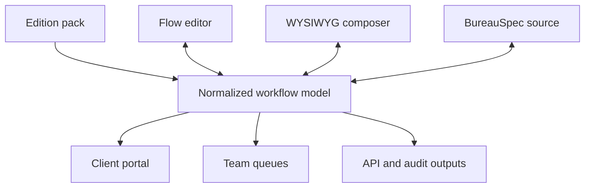

# Bureaucratizer

An edition-aware workflow studio for turning departmental procedures into
executable client experiences, team queues, evidence policies, and portable
specifications.

**Live prototype:** https://auto-bureaucratizer-studio.robinc.chatgpt.site

**Figma working file:** https://www.figma.com/design/geFcTDpEHEA80S9NV419sL

## Why it exists

Most intake products produce a form. Bureaucratizer models the operating
outcome around that form: actors, evidence, decisions, exceptions, handoffs,
presentation, and auditability.

The same normalized workflow is edited through three synchronized surfaces:

- **Flow** — a ReactFlow graph for steps, owners, decisions, and handoffs.
- **Compose** — a WYSIWYG client experience bound to the graph.
- **Spec** — human-reviewable `BureauSpec` source with validation and normalized
  compiler output.

## Prototype capabilities

- Edition packs that change vocabulary, workflow templates, policies, and
  presentation without forking the application.
- Representative Real Estate Team, Law Office, Medical Clinic, Educational
  Institution, and Business Consultant editions.
- Editable workflow nodes and per-step completion rules.
- Graph-bound client copy with a live WYSIWYG preview.
- Desktop and mobile no-account client test runs.
- Proposed `BureauSpec` meta-language for diffable, portable workflows.
- Compiler-style validation for ownership, branch completion, attributable
  evidence, and edition vocabulary.

## Product model



Editions are configuration packages rather than product forks. A future
catalog can therefore include Real Estate, Team, and Brokerage editions;
Law Office and Landlord–Tenant Paralegal editions; Solo Practice and Clinic
editions; Teacher and Educational Institution editions; and Freelancer or SMB
Consultant editions on one engine.

## BureauSpec sketch

```bureau
edition "real.estate.team" extends "core.professional" {
  vocabulary: ["Buyer", "Property", "Offer", "Brokerage"]
}

workflow "buyer-representation" version 4 {
  access: magic_link
  autosave: continuous

  step readiness_check {
    type: review
    actor: "Buyer agent"
    complete_when: evidence.accepted
    next: representation_route
  }
}

experience portal {
  explain_before_ask: true
  resume_across_devices: true
  rejection: item_level
}

evidence policy {
  audit: full
  seal: tamper_evident
}
```

See [docs/ARCHITECTURE.md](docs/ARCHITECTURE.md) for the proposed compiler and
edition boundaries, and
[examples/bureauspec/real-estate-team.bureau](examples/bureauspec/real-estate-team.bureau)
for a complete example.

## Development

Requirements: Node.js 22.13 or newer on Linux.

```bash
npm ci
npm run dev
```

Useful commands:

- `npm run build` — build and validate the Cloudflare/Vinext artifact.
- `npm test` — build, validate, and check rendered metadata.
- `npm run lint` — run ESLint.
- `npm run validate:artifact` — validate an existing build artifact.

The current prototype is a Vinext/Next.js application using React 19,
TypeScript, `@xyflow/react`, Lucide, and Cloudflare-compatible build tooling.

## Status

This repository contains an interactive product-concept prototype, not a
production workflow engine. Persistence, authentication, executable compiler
semantics, policy enforcement, integrations, and multi-user collaboration are
architectural next steps.

No software license has been selected yet.
