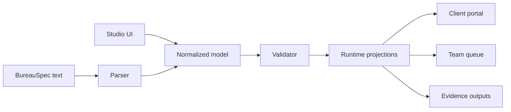

# Bureaucratizer Architecture

## Design premise

Bureaucratizer treats a workflow as a normalized domain object that can be
projected into several synchronized editing and runtime surfaces. The graph is
not the source of truth, and neither is the rendered client page. Both are
views over the same model.

## Core bounded contexts

### Workflow definition

- Steps, transitions, decisions, terminal outcomes, and handoffs.
- Human, organizational, and system actors.
- Preconditions, completion predicates, timeouts, and exception routes.
- Stable identifiers independent of visible labels.

### Experience definition

- Content blocks bound to workflow concepts.
- Progressive or overview navigation.
- Explain-before-ask copy and accessibility metadata.
- Responsive presentation hints without renderer-specific hard dependencies.

### Evidence and policy

- Required evidence, provenance, revision, acceptance, and rejection state.
- Item-level review so one correction does not invalidate an entire package.
- Retention, export, audit, and tamper-evidence policies.
- Jurisdictional and departmental overlays supplied by edition packs.

### Runtime

- A run is an immutable reference to a published workflow version plus mutable
  participant and task state.
- Client portals, internal queues, notifications, API schemas, and evidence
  packs are projections of that run.
- Runtime events should be append-only; current status is derived from events.

## Edition packs

An edition extends a core capability pack and may supply:

- vocabulary and actor aliases;
- workflow templates and reusable subflows;
- evidence types and policy defaults;
- presentation blocks, tone, and examples;
- connectors and automation recipes;
- validation rules for the intended operating environment.

The application engine remains edition-neutral. Editions inherit and override
declarative resources, allowing a brokerage edition to extend a real-estate
team edition without copying the application.

## BureauSpec goals

`BureauSpec` is a proposed textual interchange format, not an implemented
standard. It should be:

- lossless with the visual model;
- deterministic after formatting;
- stable under non-semantic UI changes;
- friendly to review, diff, generation, and version control;
- independent of a specific React component library;
- compilable into a normalized intermediate representation.

Proposed compiler stages:

1. Parse edition, workflow, experience, evidence, and automation declarations.
2. Resolve inheritance and vocabulary aliases.
3. Type-check actors, evidence references, transitions, and policies.
4. Detect unreachable steps, missing outcomes, and circular waits.
5. Emit a normalized workflow manifest.
6. Project the manifest into portal, queue, API, audit, and export targets.

## Current prototype boundary

The prototype keeps its model in React state and generates BureauSpec for
demonstration. The source editor is intentionally non-authoritative today.
Production work should extract a shared typed model, implement a parser and
formatter, add round-trip tests, and persist immutable published versions.

## Recommended next slices

1. Extract `Edition`, `Workflow`, `Step`, `Transition`, `Experience`, and
   `EvidencePolicy` into a versioned schema package.
2. Implement BureauSpec parse/format/validate round trips.
3. Add local persistence and a run simulator before adding external systems.
4. Add workspace identity, role policy, and immutable publication semantics.
5. Implement one deep edition vertical before broadening the edition catalog.
